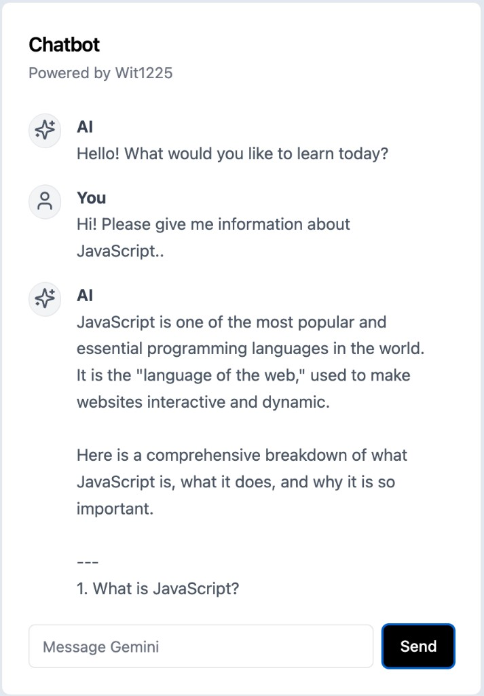

# Gemini-Sohbet AI ChatBot

Google Gemini API ile çalışan basit bir sohbet arayüzü. [Vite](https://vite.dev/) ve [React](https://react.dev/) ile geliştirilmiştir; arayüzde [Tailwind CSS](https://tailwindcss.com/) kullanılır.

## Önizleme



## Özellikler

- Metin tabanlı sohbet (kullanıcı / model mesajları)
- `@google/generative-ai` ile doğrudan tarayıcıdan Gemini çağrısı
- Yükleme durumu ve hata mesajı gösterimi

## Gereksinimler

- [Node.js](https://nodejs.org/) (LTS önerilir)
- [Google AI Studio](https://aistudio.google.com/apikey) üzerinden alınmış bir Gemini API anahtarı

## Kurulum

```bash
npm install
```

## Ortam değişkeni

Proje kökünde `.env` dosyası oluşturun:

```env
VITE_GEMINI_API_KEY=buraya_api_anahtariniz
```

Vite, `VITE_` ile başlayan değişkenleri istemciye dahil eder. Bu nedenle anahtar üretim ortamında tarayıcıda görülebilir; hassas kullanımlar için anahtarı yalnızca sunucu tarafında tutan bir proxy önerilir.

## Komutlar

| Komut        | Açıklama                          |
| ------------ | --------------------------------- |
| `npm run dev`    | Geliştirme sunucusu (`localhost`) |
| `npm run build`  | Üretim derlemesi (`dist/`)        |
| `npm run preview`| Derlemeyi yerel önizleme          |
| `npm run lint`   | ESLint                            |

## Proje yapısı

```
src/
  App.jsx              # Sohbet durumu, Gemini çağrısı, düzen
  main.jsx             # React giriş noktası
  components/
    Chatbot.jsx        # Model mesajları
    User.jsx           # Kullanıcı mesajları
  App.css, index.css   # Stiller (Tailwind + ek sınıflar)
```

## Kullanılan model

Uygulama `App.jsx` içinde `gemini-3-flash-preview` modelini kullanır. Google tarafında model adları veya kullanılabilirlik değişirse bu satırı güncellemeniz gerekebilir.

## Lisans

Bu depo `package.json` içinde `private: true` olarak işaretlenmiştir; dağıtım/lisans tercihi size aittir.
