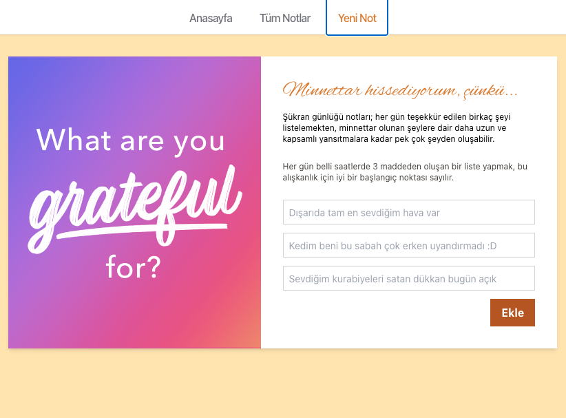

# Şükran Günlüğü

Günlük üç maddeyle minnettarlık notları tutan React uygulaması. Notlar API üzerinden alınır/eklenir/silinir; durum **Redux** + **redux-thunk**, kalıcılık **localStorage** (`s10d5`).

**Sayfalar:** `/` tanıtım · `/notlar` liste ve sil · `/yeni-not` form (POST sonrası listeye yönlendirme).



**Yığın:** Vite, React 18, Tailwind, react-router-dom v5, Redux, axios, react-hook-form, react-toastify. Test: Vitest, Testing Library, MSW.

**Çalıştırma**

```bash
npm install && npm run dev
```

`npm run test` — Vitest; testlerde API MSW ile mock’lanır (`src/mocks/`).
