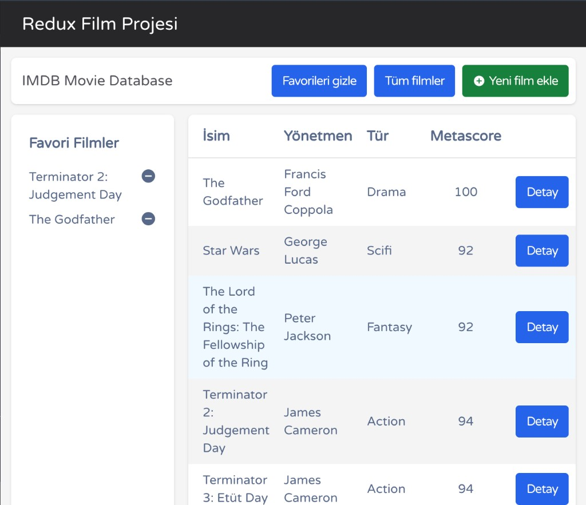

# Redux Film Projesi

Film listesi, favoriler, yeni film ekleme ve detay sayfaları. Durum **Redux** ile yönetilir.



## Özellikler

- Film tablosu (isim, yönetmen, tür, Metascore)
- Favori listesi
- Yeni film formu ve film detayı (routing)

## Teknolojiler

**Arayüz:** React 18, Redux, React-Redux, React Router v5, Tailwind CSS  

**Araçlar:** Vite, ESLint, Vitest, Testing Library, PostCSS

## Çalıştırma

```bash
npm install
npm run dev
```

Derleme: `npm run build` · Önizleme: `npm run preview` · Test: `npm test`

## Klasörler

- `src/components/` — bileşenler  
- `src/store/` — Redux  
- `src/data.js` — örnek veri  
