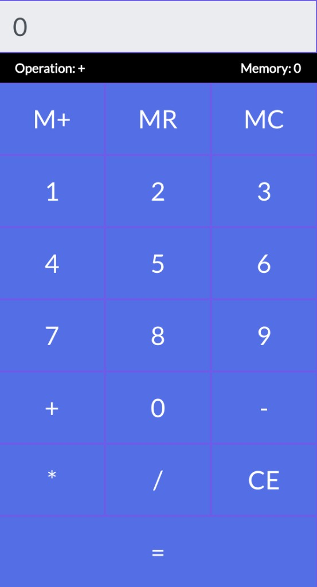

# Basit Hesap Makinesi



React ve Vite ile yazılmış tarayıcı hesap makinesi. Durum yönetimi `useReducer` ile yapılır; temel işlemler ve bellek (M+, MR, MC) desteklenir.

## Kullanılan teknolojiler

- **React 18** — arayüz ve `useReducer` ile durum yönetimi
- **Vite 5** — geliştirme sunucusu ve derleme
- **JavaScript (JSX)** — bileşenler
- **Bootstrap 4** — yerleşim ve stiller (CDN)
- **Vitest** — birim testleri; **React Testing Library** ve **jsdom**
- **ESLint** — kod kalitesi (React eklentileriyle)

## Kurulum ve çalıştırma

```bash
npm install
npm run dev
```

Üretim derlemesi: `npm run build` · önizleme: `npm run preview` · testler: `npm test`
